# Codist

*Codist* is a Visual Studio extension which strives to provide better coding experience and productivity for C# programmers.
Codist 是一个致力于为 C# 程序员提供更佳的编码体验和效率的 Visual Studio 扩展。

# Features

Check out this list to see what _Codist_ can do for you.

* [Advanced Syntax Highlight](#advanced-c-syntax-highlight) ANY LANGUAGES, and [*Comment Tagger*](#comment-tagger-and-styles) highlights `to-do` style comments
  
* [Super Quick Info](#super-quick-info) with extended XML Doc, *Click and Go* to source code
  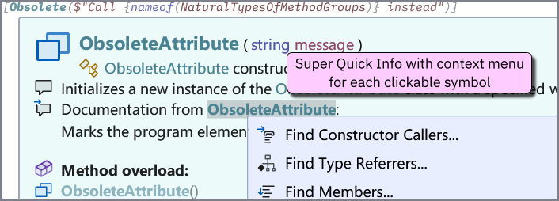
* [Navigation Bar](#navigation-bar) with a drag-and-drop and filter enabled member list
  
* [Smart Bar](#smart-bar) with common edit commands and symbol reference analyzers
  
* [Scrollbar Marker](#scrollbar-marker) draws a powerful mini code map
  
* [Display Enhancements](#display-enhancements)
* [Codist in Your Language](#codist-in-your-language)
* [Others](#other-features)
* [Comprehensive Configurations](#feature-control)
* [Acknowledgements](#acknowledgements)
* [License](#license), [Bugs and Sugguestions](#bugs-and-suggestions), [Donate](#support-codist-by-donation)

_Codist_ supports localization into other languages and it has both English and Chinese now.

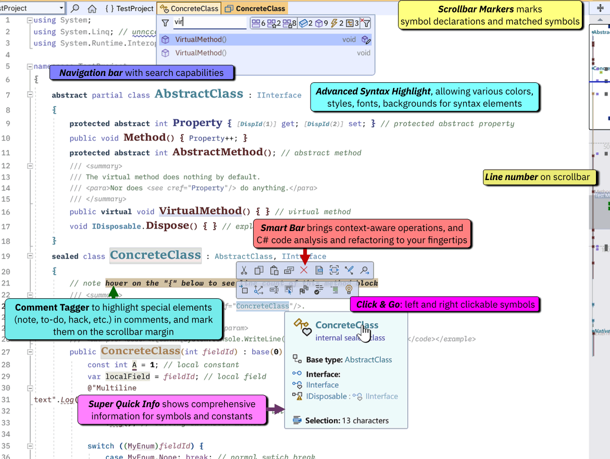

## Advanced C# Syntax Highlight

  The advanced syntax highlight function highlights every aspect of C# language elements with diverse styles, including using various font families and text styles, enlarging or shrinking font sizes, changing foreground or background colors and transparency.

  You can change syntax highlight styles in any languages, such as Visual BASIC, F#, SASS, and so on, even if they are not recognized by Codist.

  The following screenshots of the `TestPage.cs` file in the source code project demonstrates possible syntax highlight effects in the Light theme.

   

  * The font size of type and member declarations can be enlarged, font families are also changeable, so it is much easier to spot them.
  * Syntax highlight can be applied to braces and parentheses.
  * Various syntax identifiers have different styles, temporary elements such as method parameters and local variables are italic, `static` symbols are underlined.
  * Comment content can be tagged (e.g. _note_) and highlighted with individual style.
  * Unnecessary code can be marked strike-through.
  * Keywords are categorized and highlighted with various styles (e.g. `abstract` and `sealed`, `return` and `throw`, etc.).
  * Overriding members (such as `ToString`) can be painted with gradient background color, so at a glance we know that the marked implementations have overrided their base classes.
  * Imported symbols (from external assemblies, e.g. `NotImplementedException`, `ToString`) can be marked with a different style (bold here), distinguishing from symbols defined in your code.
  * All the above styles are customizable.

### Default Syntax Highlight Themes

  To quickly get started with advanced syntax highlight, open a C# project, then click the _Customize Codist Syntax Highlighting_ command under the _Tools_ menu.

  A window will pop up, click buttons at the left side of the dialog under the **Predefined themes** and see changes in effect. From version 5.11 on, there is a new theme named **Pale** for your choice. The styles on the right of the dialog immediately lists effects of corresponding syntax elements. Don't forget to click the *OK* button to confirm the changes.

  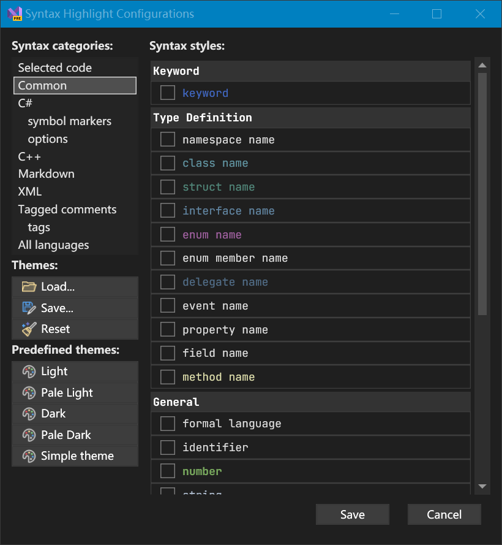

  With the **Save** and **Load** buttons, you can backup and share your own syntax highlight settings.

  If you mess up your syntax highlight styles, you can press the **Reset** button to reset all settings to default, or press the _Light theme_ or _Dark theme_ button to reapply predefined themes.

  **Note**: There is a known issue in _Codist_ that if you change the theme of Visual Studio, you may have to restart it to make syntax highlight settings to work properly.

### Customization of Syntax Highlight Styles

  To customize and tweak the desired syntax highlight styles, click or select the text in the document window, and click the _Customize Codist Syntax Highlighting_ command under the _Tools_ menu.

  The customization window will pop up and listing syntax classifications applied to the active text.

  

  Click the style in the Syntax Styles list, adjustment controls will be displayed at the bottom of the dialog, where you can change the style. As you change the style, you can immediately see how it appears in the code document window.

  

  If you want to change another syntax element, you can click on the place where it is applied in the code document window. If the customization window is still opened, and the _Selected Code_ section under _Syntax Categories_ is selected, the list will display the corresponding syntax styles for the place you clicked immediately.

  You can explore other synta categories by clicking the list on the left of the dialog.

  Syntax definitions in the _All languages_ section will list all syntax styles for any languages installed; those under _Tagged comments_ section apply to comment taggers (see below), others apply to corresponding languages accordingly.

  **Note**: _Font size_ is relative value to editor default font size. Halfly checked checkboxes denote default syntax styles are used.

  **A Side Note for Editor Font**: You may consider subsituting the font used by Visual Studio code editor with professionally designed fonts for programming, for instance, [IBM Plex Mono](https://github.com/IBM/plex), [Fira Code](https://github.com/tonsky/FiraCode), etc. Employing [MacType](https://github.com/snowie2000/mactype) can also enhance systemwide textual display quality, especially for Chinese, Japanese and Korean programmers.

### My Symbols and External Symbols

  _Codist_ can identify symbols which are defined in your source C# code and which are imported from external assemblies. This feature is so unique that you may not find it elsewhere.

  You can customize it in the *symbol markers* section under the *C#* section in the *Syntax Highlight Configurations* dialog. Style _C#: User symbol_ is used for symbols from your code, and _C#: Metadata symbol_ is used for symbols imported from external assemblies.

  **Note**: the predefined _Light theme_ and _Dark theme_ have defined external symbols with **bold** style, as the above screenshot shows.

## Comment Tagger and Styles

  * The comment tagger highlights comments to your specific styles, according to the first token inside the comment.

    Here are default effects of the some tagged comments.

    

    To configure the comment tags, click the *tags* section, under the *Tagged comments* section in the *Syntax Highlight Configurations* dialog, where you can add, remove or modify comment tags.

    

    To disable comment tagger, open the _Options_ dialog, find the _Codist/Syntax Highlight_ section and  uncheck the check box labeled _Enable comment tagger_ in the _Syntax Highlight_ option page.

## Super Quick Info

  The quick info (the tooltip shown when you hover your mouse pointer on your C# source code) can be enhanced by *Codist*.

### General Quick Info

  To customize the *Super Quick Info*, adjust the settings in the options page.

  

  Options in the _General_ page apply to all code editor windows.

  * **Hide Quick Info until Shift key is pressed**

    By default, _Quick Info_ appears when you hover your mouse over a symbol or syntax token in code editor. Some programmers think this behavior interferes their workflow. Checking this option will suppress the _Quick Info_ until Shift key is pressed.

  * **Show info about selection length**

    This option will show how many characters and lines in your selection (if your selection spans over multiple lines). So you don't have to count characters one by one.

    

  * **Show info about color**

    This option enables you preview color values. It works for hex color values (such as `#00FF00`，`#FF993300`), named colors (such as `Black`, `White`, etc.).

    

    In C# code editor, it analysis system colors (such as `SystemColors.WindowColor`, `SystemColors.Control`, etc.), `Color.FromArgb` or `Color.FromRgb` expression with constant values as well.

    

    The color info not only works in code windows, but also in debugger _Watch_ window.

    

  * **Quick Info item size**
    
    It is possible to limit the size of each Quick Info item, so they won't cover your whole screen. Previously, this feature works in C# editor only.

    By default, _Codist_ does not apply size limitations. You must manually set the _Max width_ and _Max height_ here. Extra height can be assigned to C# XML Documentations, so you can read more of them at a glance. If the contents exceed the width, they are wrapped, and scrollbars will appear when necessary, as the screenshot below demonstrates.

    

### C# Quick Info

  _Super Quick Info_ especially enhances programming experience for C# programmers. There are plenty of options available in the options page.

  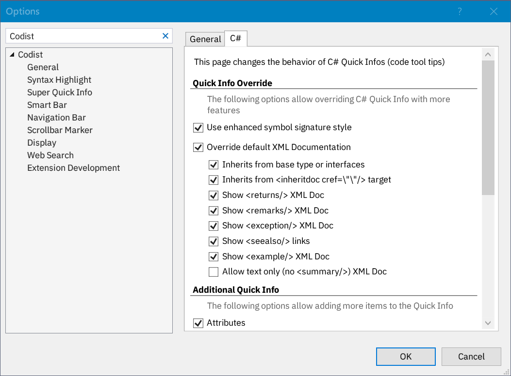

* **Click and go** to source code of symbol definition

  If a symbol is defined in your source code, you can click and go to its definition on the Quick Info window. No need to hit `F12` on your keyboard any more! Even more, _Codist_ also tells you where the symbol is defined if you hover your mouse over it.

  

* A **Context menu** with many symbol analysis commands will show up when you right click the signature of the symbol definition or any symbol that appears in the XML Doc.

  

* **Override XML Documentation**

  The overridden XML Documentation makes the following changes to the documentation.

  * More syntax colors (adopting syntax highlight colors) for symbols.
  * Icons for documetation parts.
  * Selectable content of the documentation.
  * Copyable quick info content (First select text with your mouse, then press `Ctrl + C` shortcut key, or right click to show up a context menu with Copy command).
  * Symbols inside the documentation work with _Click and Go_ feature too. i.e. you can click them and go to the source code if available.
  * Concise form of members (without leading namespace or containing type names, hover your mouse over a symbol to view its full definition).
  * Extra tags, such as `<b>` (for bold), `<i>` (for italic) and `<u>` (for underline) are supported.
  * Extra information from documentations (see below).

  

  When _Override XML Documentation_ checkbox is checked in the options page, it is also possible to activate options under it.

  * **Inherit from base type or interfaces** option will show documentation description from base `class`es or implemeted `interface`s if the XML Doc description of the current symbol is absent.

    

  * **Inherit from `<inheritdoc cref="MemberName"/>` target** option will borrow description from the referenced `MemberName`.

    

  * **Show `<returns>` XML Doc** and **Show `<remarks>` XML Doc** will add content of those tags.

  * **Override `<exception>` XML Doc** option adds back documentations for exceptions to the Quick Info.

    

   _Codist_ shows XML Doc for those `namespace`s with an embedded `NamespaceDoc` class, like what is done in [SandCastle](https://github.com/EWSoftware/SHFB).

   

  * **Use alternative style** option moves the glyph of the symbol to the bottom-right of the quick info, and [removes individual hyperlinks within the symbol signature parts](https://github.com/wmjordan/Codist/issues/102), which comes with Visual Studio 2019 update 3, in order to make it easier to use the _Click and Go_ feature on the symbol.

### Additional Quick Info Items

   A dozen of additional quick info items could be displayed in the _Additional Quick Info Items_ options page.

   

* **Attributes** option shows attributes of a symbol.
* **Base types and interfaces** options shows inheritance and implementation info of a type. It is recommended to check **All ancestor types** and **Inherited interfaces** to display the complete info of the hierarchy of a type.

  

  Note: the `IDisposable` interface has special importance in .NET programming, thus it is assigned a special icon and pinned to the top of the interface list.

* **Declaration modifier** option shows modifiers to a symbol when it is not a public instance one.

  

* **Interface implementation** option shows if a member implements any interface.

  

* **Method overload** options shows possible overloads of a method (including applicable extension methods).

  

  This option also helps you find out correct overloads when any argument passed to a method is incorrect.

  

* **Parameter of method** options shows whether a token or an expression is the parameter of a method in the argument list. What is more, the documentation of the parameter is also displayed.

  

* **Type parameter** option shows information and documentation about type parameters.

* **Symbol location** shows where a symbol is defined.

* **Numeric forms** shows decimal, hexadecimal and binary forms for constant integer and `Enum` values.

  

  The binary form is useful when working with bit flags.

  

* **String length and Hash codes** for string constants.
  (Hint: We can use Hash codes to quickly compare whether two strings that look alike are identical)

## Navigation Bar

  _Navigation bar_ locates at the top of the code editor window. It overrides the original navigation bar. When the _Navigation Bar_ is loadeded, it hides two drop-down lists on the original Navigation Bar, but preserves the project drop-down list.

  Basically, the _Navigation Bar_ serves the same purpose of the original one, displaying symbol information where the caret is placed.

  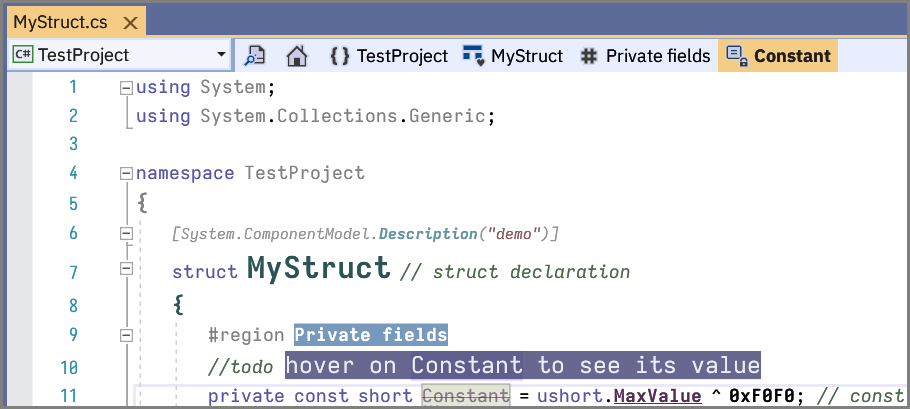

  **Note**: Navigation Bar works with both C# code documents and Markdown documents.

  Nodes on the _Navigation Bar_ are clickable.

  1. Clicking on the left-most **Search Document node** will popup a menu, displaying namespaces and types defined in the active document.

     On top of the menu there is a **Search Declaration** box, within which you can type and search declarations.

     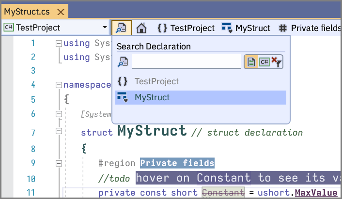

     Besides the _Search Declaration_ box, there are three buttons. The first one is pressed by default, which restricts the search scope to active document. If the second one is pressed, it pops up the first button and expands the search scope to current project (see screen shot below). The third button clears the search box and reverts the items back to unfiltered namespaces and types.

      From version 5.10 on, you can press `-` or `=` key on your keyboard to switch search scope between current document and current project.

     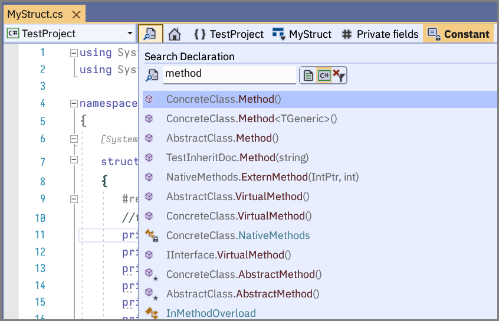

     **Note**: If the first character in the search box is an upper case one, the search will be **case-sensitive**, otherwise, it is case-insensitive.

     You can **drag and drop** items in the menu to reorder types within the document.

  2. Clicking on the **global namespace node** which has a house as the icon will popup a menu, displaying all root namespaces defined in the project and referenced assemblies, as well as types without any namespace. You can click namespaces to check out its sub-namespaces and types.

     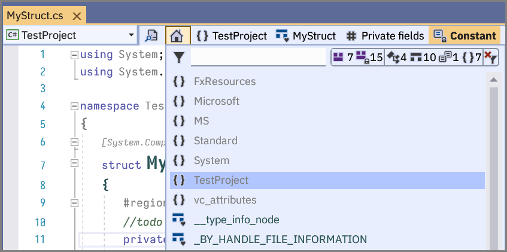

     There is also a search box in this menu, which filters content of the menu.

     There are several buttons beside the search box. Numbers on the buttons counts corrsponding items within the type. Hover your mouse cursor over the button, you can read meanings of them. Pressing down those buttons filters members within the menu to corresponding ones.

     You can right click items on the menu to bring out a context menu for curresponding members.

  3. Clicking a **Namespace node** which follows the Document node will popup a menu, displaying namespaces and types defined in the corresponding namespace. You can click on those items and jump to the beginning of corresponding definitions.

  4. Clicking on a **Type node** will popup a menu, displaying members and regions defined within the type. You can click on those items and jump to the definition of the corresponding member.

     You can **drag and drop** items in the menu to reorder members, nested types and `#region`s within the document. If a `partial` type spans over several code files, it is also possible to rearrange members among them.

     

     The current symbol where the caret is on is highlighted.

     Field values and auto-property expressions are also displayed on this menu. So, you can read the initial value of fields immediately.

     You can right click items to bring out a context menu for the symbol.

     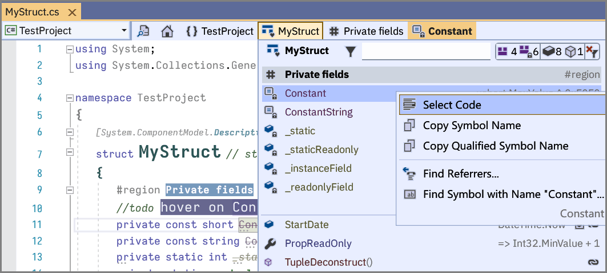

   5. Clicking on a **Member node** will select the whole member. If you have the _Smart Bar_ feature on and let it appear when selection is changed, _Smart Bar_ will be displayed and let you perform actions onto the member.

      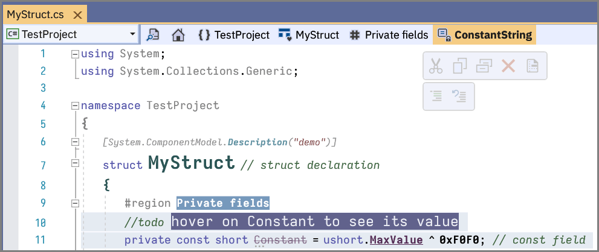

### Customization

  The _Navigation Bar_ can be configure via the options page.

  

  * If **Syntax detail** option is set, the _Navigation Bar_ not only shows available types and declarations in the code window like the original navigation bar, but also syntax nodes such as statements and expressions containing the caret.

    

  * If **Symbol info tip** option is set, you can read information about a symbol when you hover your mouse onto a node.

    

  * If **Highlight syntax range** option is set, when you hover the mouse over the node on the bar, corresponding span of the node will be highlighted in the editor.

    

   * If **Region** option is set, `#region` names will be displayed on the Navigation Bar. If you pad region names with some non-alphabetic characters like "`#region [====== private methods ======]`", you can check the **Trim non-letter characters in region** checkbox so only alphabetic part like "`private methods`" will be displayed on the _Navigation Bar_.

  To customize drop-down menus of the _Navigation Bar,_ change options in the _Drop-down Menu_ tab.

### Markdown Navigation Bar

  The Markdown navigation bar lists all titles appear in a Markdown document.

  

  Similarly, you can type in the search box to filter down the titles.

## Smart Bar

  The *Smart Bar* is a context-aware tool bar that appears automatically when you select some text, or double tap the _Shift_ key on your keyboard.

  There are two toolbars on _Smart Bar_. The top bar contains general editing commands for all file types. Buttons on the bottom bar changes according to file types.

  Buttons on the *Smart Bar* changes according to your selection, typical buttons are editing operations (e.g. _Cut_, _Copy_, _Paste_,  _Delete_, _Duplicate_, _Formatting_, _Find_, etc.), code analysis operations (e.g. _Go to defintion_, _Find references_), refactoring operations (e.g. _Rename_, _Extract method_, etc.)

  

  Each button on _Smart Bar_ usually has multiple functions. Left clicking, right clicking, Ctrl+clicking and Shift+clicking trigger different commands. For details, see the tooltip for the buttons. Right clicking a button usually expands the effective range of a command to the whole line, or brings out a pop-up menu for more commands.

  

  There are multiple predefined **web search** commands in the menu when you right click the Find button, which will launch your browser to search the text you select in document window. So, it is handier to look for answers from the web or find code examples in _GitHub_.

  

  You can specify what browser you prefer to use in the options page.

  

### C# Specific Commands

  When you select a symbol, you may probably see a _Smart Bar_ like below.

  

  The C# commands are on the second row.

  The first one is **Go to Definition**, that behaves the same as the keyboard `F12` command. With this, you no longer need hitting the `F12` key to go to definition.

  The second one is the **Analyze symbol...** button, a menu will pop up showing possible symbol analysis commands for the symbol. Since some commands require considerable amount of calculation, items ending with "..." will require a mouse click to expand. For instance, clicking the **Find Callers** command in the following screen shot will search the source code and list at what places are calling the selected method in a symbol list. In the symbol list, you can filter items like the what you can do in the _Navigation Bar_, click items on the sub-menu and jump to the corresponding location.

  

  Various commands will be conditionally listed under the **Analyze symbol...** menu. Here is a list of commmands for an interface.

  

  The **Find Members** command under **Analyze symbol...** lists all members defined within a type. For some special types, for instance, `SystemColors`, `Colors`, `Brushes`, etc. The preview is shown on the list.

  

  For Visual Studio extension developers, the preview offers more, for instances, it allows previewing images of `KnownImageIds`, colors in `VsBrush`, etc.

  

  The **Find Implementations** command for an interface type will display all types that implement that interface. The same command will also appear for interface members, which finds out corresponding members that implement the specific interface member.

  When we begin to work with new libraries, we usually have to learn new types and APIs. Two typical senario are that "_what methods, properties return specific instance of a type?_" and "_what methods can an instance of a given type can be passed into?_". Thus, _Smart Bar_ provides _Find Instance Producer_ and _Find Instance as Parameter_ for type names. The following screen shot demonstrates the reslt of finding instance producers which returns an instance of `IWpfTextView`.

  

  There are two buttons on the top right corner in the result list of symbol analysis commands. The _Pin_ button will keep the list on the screen. And you can use your mouse to drag those lists around.

### Symbol Marker

  _Symbol marker_ draws markers for C# symbols.

  Typically, you can double click a symbol in the C# source code, select the *Mark Symbol* command on the *Smart Bar* and choose the desired highlight marker on the drop-down menu.

  

  After applying the command, all occurrences of the marked symbol will be marked with a different style.

  

  To remove symbol marker, click the *Remove symbol mark* command in the drop-down menu of the *Mark symbol* command.

  Symbol markers will be cleared when the solution is unloaded.

  **Note**: The style of symbol markers can be customized in othe *Syntax highlight Configurations* dialog. The default colors are listed below. You also need to turn on the _Syntax Highlight_ feature in order to make this feature work.

  

### Behavior of Smart Bar

  By default, _Smart Bar_ appears after selection changes, you can alter the behavior in the options page by unchecking the _Show Smart Bar when selection is changed_ checkbox.

  

  _Smart Bar_ automatically disappears when you move your mouse cursor away from it, or execute a certain commands on the _Smart Bar_, or click somewhere else in the code editor window, emptying the selection.

  To make the _Smart Bar_ reappear, you can tap the `Shift` key on your keyboard twice within a second. This behavior can also be suppressed by unchecking the **Show/hide Smart Bar with Shift key** checkbox.

### Smart Bar in Other Windows

  _Smart Bar_ also works on _Output_, _C# Interactive_, _Immediate (Debug)_, _Find Results_ and some other text selectable window panes. If you select a path within those windows, extra commands will pop up allowing you to open it directly or locate it in _Windows Explorer_.

  

## Scrollbar Marker

  _Scollbar Marker_ draws extra glyphs and shapes on the vertical scrollbar for the following syntax elements:

  * **Line numbers** (marked with gray dashed lines and numbers)
  * Selection range (marked with semi-trasparent color blocks over the bar)
  * Special comments tagged by comment tagger (marked with small squares)
  * C# `class`/`struct`/`interface`/`enum` **declarations** (marked with lines indicating their ranges and a square, and their names indicating their declaration locations)
  * C# compiler directives, e.g. `#if`, `#else`, `#region`, `#pragma`, etc. (marked with a gray spot)
  * C# symbol match marker (matches symbol under the caret, marked with an aqua square)

  Please see the first screenshot of this article. The markers can be toggled via the options page.

  

## Display Enhancements

  In the *Display* tab of the *General* options page, several display enhancement options are offered.

  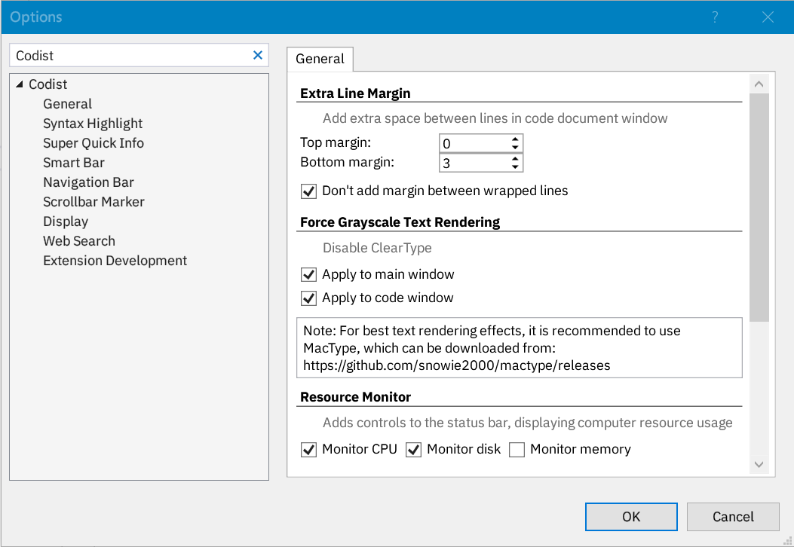

  Within the *Extra line margins* group box, you can adjust margins between lines to make code lines more readable.

  Programmers who do not like *ClearType* rendering, which made text blurry and colorful, may want to try _Force Grayscale Text Rendering_ options.

  It is possible to use Compact menu like _Visual Studio 2019_ in _Visual Studio 2017_. Simply checking the _Move main menu to title bar_ option will do.

  

## Codist in Your Language

  It is possible to localize _Codist_ to other language. Simplified Chinese (简体中文) and English are provided by default.

  The interface of _Codist_ will change according to the _International_ settings of _Visual Studio_.

## Other Features

  It is possible to output a time stamp after each build.

  For VSIX developers, there is also an option to automatically increment version number for your VSIX manifest file.

# Feature Control

  Open the *Codist* section in the *Tools->Options* dialog. In the *General* section you can toggle features of *Codist*.

  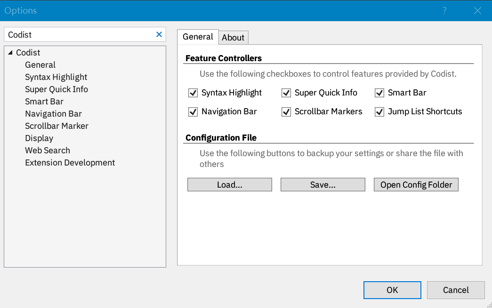

  1. *Feature controllers* contains check boxes which can be used to enable/disable features of *Codist*.

     When you are running on a laptop with battery. Disabling *Codist* may help it sustain a little bit longer.

     Someone who does not like the syntax highlight or use another syntax highlighter can also turn off the *Syntax Highlight* feature individually here.

     These **options will take effect on new document windows**. Existing document windows won't be affected.

  2. To share or backup your settings of Codist, you can use the *Save* and *Load* buttons.

# Acknowledgements

  I have learned a lot from the following extension projects (sorted by the time when I learned from them).

  * CommentsPlus: https://github.com/mhoumann/CommentsPlus
  * Better comments: https://github.com/omsharp/BetterComments
  * Remarker: https://github.com/jgyo/remarker
  * Font Sizer: https://github.com/Oceanware/FontSizer
  * Visual Studio Productivity Power Tools: https://github.com/Microsoft/VS-PPT
  * Inheritance Margin: https://github.com/tunnelvisionlabs/InheritanceMargin
  * CoCo: https://github.com/GeorgeAlexandria/CoCo
  * CodeBlockEndTag: https://github.com/KhaosCoders/VSCodeBlockEndTag
  * UntabifyReplacement: https://github.com/cpmcgrath/UntabifyReplacement
  * Extensiblity Tools: https://github.com/madskristensen/ExtensibilityTools
  * CodeMaid: https://github.com/codecadwallader/codemaid
  * Select Next Occurence: https://github.com/2mas/SelectNextOccurrence
  * VSColorOutput: https://github.com/mike-ward/VSColorOutput
  * NuGet: https://github.com/NuGet/NuGet.Build.Packaging
  * GoToImplementation: https://github.com/GordianDotNet/GoToImplementation
  * Roslyn: https://github.com/dotnet/roslyn
  * Community.VisualStudio.Toolkit: https://github.com/VsixCommunity/Community.VisualStudio.Toolkit

  And every donaters, beta testers, feedback providers to this project.

# License

  _Codist_ comes from the open source community and it goes back to the community.

  _Codist_ is **free** software: you can redistribute it and/or modify it under the terms of the GNU General Public License as published by the Free Software Foundation, either version 3 of the License, or (at your option) any later version.

  This program is distributed in the hope that it will be useful, but WITHOUT ANY WARRANTY; without even the implied warranty of MERCHANTABILITY or FITNESS FOR A PARTICULAR PURPOSE. See the GNU General Public License for more details.

  You should have received a copy of the GNU General Public License along with this program. If not, see "https://www.gnu.org/licenses".

# Bugs and Suggestions

  Please [post New Issue](https://github.com/wmjordan/Codist/issues) in the [GitHub project](https://github.com/wmjordan/Codist) if you find any bug or have any suggestion.

  Your vote and feedback on the [Visual Studio Extension Marketplace](https://marketplace.visualstudio.com/items?itemName=wmj.Codist) are also welcomed.

# Support Codist by Donation

  If you like _Codist_, consider [buying me a cup of Chinese tea](https://paypal.me/wmzuo/19.99).

  You can donate any amount of money as you like. The recommended amount of donation is `$19.99`.

  4 donations have been received so far :)
